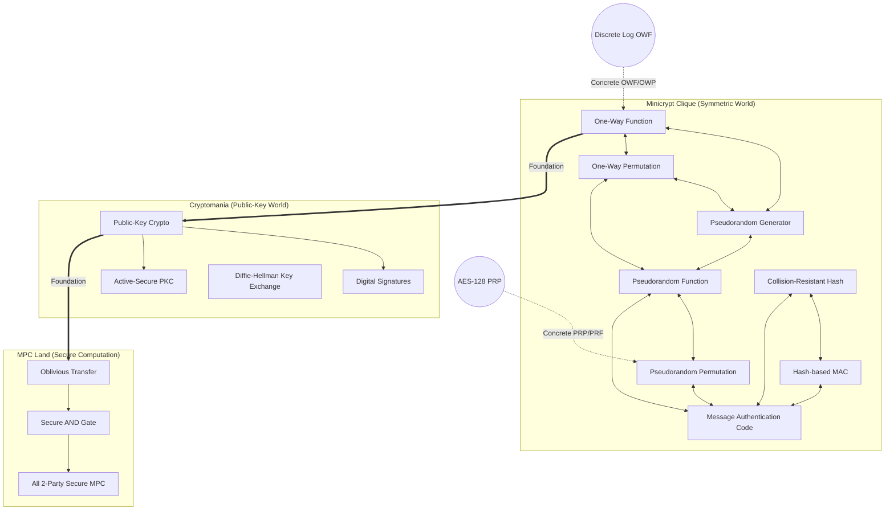
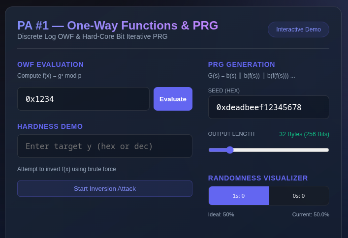
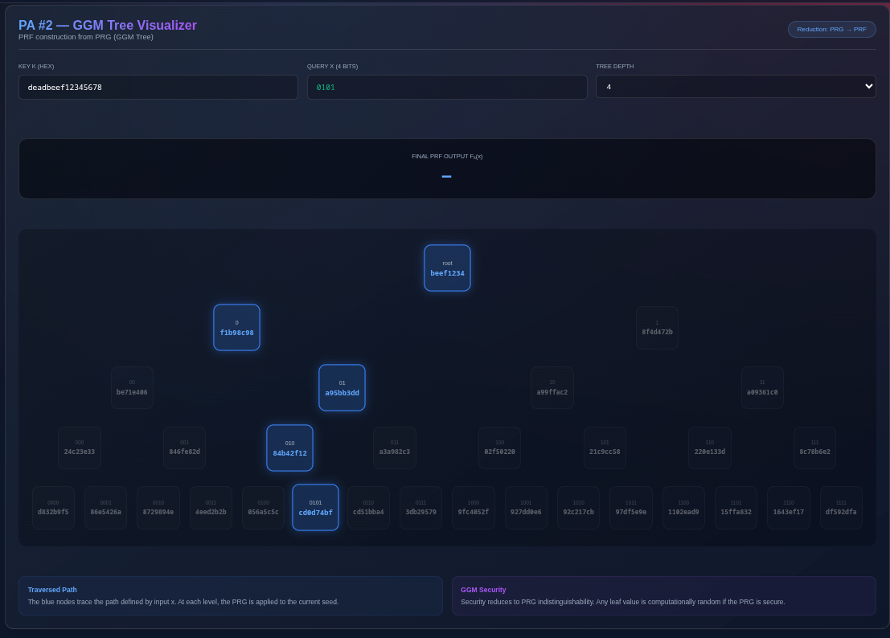
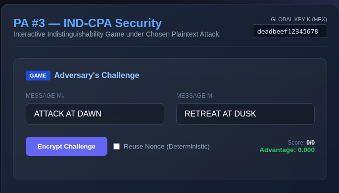
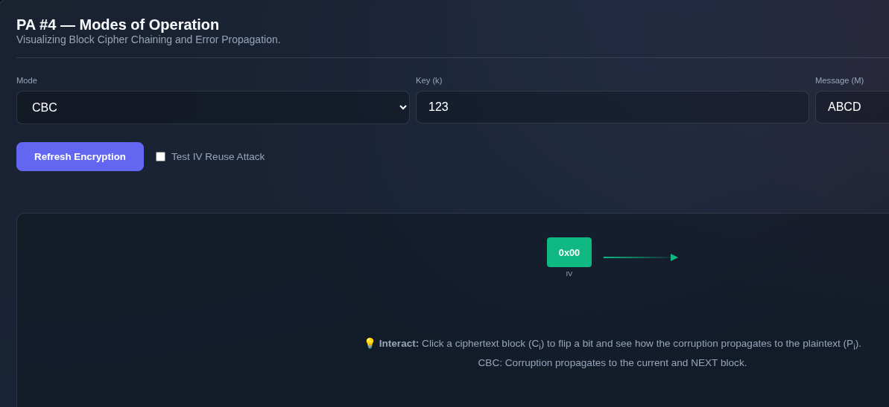
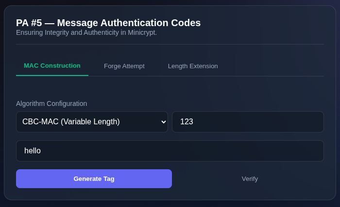
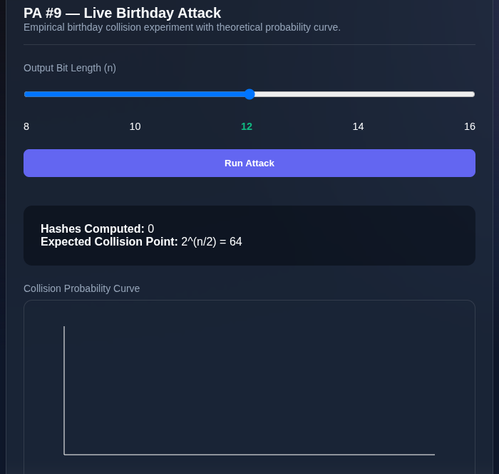
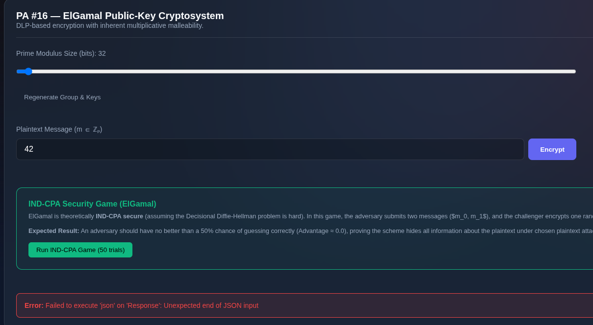

# 🔐 Minicrypt Clique Explorer

> **CS8.401: Principles of Information Security (POIS) Project**  
> An interactive, visual, and educational cryptographic playground that traces the reduction chains of symmetric, public-key, and multi-party computation primitives from first principles.

---

## 🌌 Introduction & Theoretical Foundations

Modern cryptography is built on a hierarchy of computational assumptions. This project is a complete realization of the **Minicrypt** and **Cryptomania** complexity worlds proposed by Impagliazzo (1995), demonstrating how complex systems are bootstrapped from simple assumptions.



### 🚫 The "No-Library" Rule
Every cryptographic primitive used in this project is implemented **entirely from scratch**. External libraries (such as `PyCryptodome`, `cryptography`, `hashlib`, or `openssl`) are strictly forbidden. The only allowed imports are standard libraries for arbitrary-precision integer arithmetic (`int` in Python) and OS-level secure randomness (`os.urandom`). 

---

## 🛠️ Project Architecture

The application is structured as a client-server architecture:
*   **Backend (`server.py` + `pa1.py` to `pa20.py`)**: A Python-based **FastAPI** application implementing low-level cryptographic functions, verification games, and simulations from scratch.
*   **Frontend (`frontend/`)**: A modern **React** + **Vite** web application providing rich interactive visualizations, simulations, and real-time step-throughs of the reduction chains.

---

## 🚀 Getting Started

### Prerequisites
*   **Python**: `3.8+`
*   **Node.js**: `16+` and `npm`

### 1. Running the Backend Server
First, navigate to the project root and install the backend dependencies.

> [!NOTE]
> The `requirements.txt` file in this repository is a copy of the comprehensive assignment specification PDF text. To install the actual required packages, run the command below:

```bash
pip install fastapi uvicorn pydantic
uvicorn server:app --host 0.0.0.0 --port 8000
```
The FastAPI documentation will be available at `http://localhost:8000/docs`.

### 2. Running the React Frontend
Navigate to the `frontend` folder, install packages, and start the development server:
```bash
cd frontend
npm install
npm run dev
```
Open your browser and visit `http://localhost:3000` (or the URL displayed in your terminal).

---

## 📊 Programming Assignments (PA) Index

The project spans **20 distinct Programming Assignments**, bridging SKE, Hashing, PKC, and MPC:

| PA # | Topic / Primitive | Core Concept | Implementation Files | Interactive UI Features |
| :--- | :--- | :--- | :--- | :--- |
| **0** | **Web Explorer** | Scaffold the visual representation of the Minicrypt Clique | `server.py`, `frontend/src/App.jsx` | Dynamic reduction path router, toggles for foundations. |
| **1** | **OWF & PRG** | Iterative Hard-Core Bit (LSB) construction (DLP / Blum-Micali style) | [pa1.py](file:///tmp/temp/MiniCrypt---A-Crypto-Tutorial/pa1.py) | Seed expansion sliders, NIST Monobit, Runs, and Serial tests. |
| **2** | **PRF (GGM Tree)** | GGM tree traversal; PRG $\leftrightarrow$ PRF bidirectional proof | [pa2.py](file:///tmp/temp/MiniCrypt---A-Crypto-Tutorial/pa2.py) | GGM binary tree path traversal animator. |
| **3** | **CPA-Secure SKE** | Randomized PRF-based Symmetric Encryption | [pa3.py](file:///tmp/temp/MiniCrypt---A-Crypto-Tutorial/pa3.py) | Interactive IND-CPA game. Nonce reuse attack simulator. |
| **4** | **Modes of Operation** | CBC, OFB, and CTR modes of operation from scratch | [pa4.py](file:///tmp/temp/MiniCrypt---A-Crypto-Tutorial/pa4.py) | Cipher block animation with interactive error propagation. |
| **5** | **Secure MACs** | PRF-MAC, CBC-MAC, and Naive hash-MAC vulnerabilities | [pa5.py](file:///tmp/temp/MiniCrypt---A-Crypto-Tutorial/pa5.py) | EUF-CMA forgery dashboard and Length Extension attack visualizer. |
| **6** | **CCA-Secure SKE** | Encrypt-then-MAC (EtM) paradigm with key separation | [pa6.py](file:///tmp/temp/MiniCrypt---A-Crypto-Tutorial/pa6.py) | Malleability comparisons between CPA-only and CCA (EtM) schemes. |
| **7** | **Merkle-Damgård** | Domain extension for fixed-length compression functions | [pa7.py](file:///tmp/temp/MiniCrypt---A-Crypto-Tutorial/pa7.py) | Step-by-step block-chaining viewer with MD-padding analysis. |
| **8** | **DLP-based CRHF** | Chaum-van Heijst-Pfitzmann style DLP hash function | [pa8.py](file:///tmp/temp/MiniCrypt---A-Crypto-Tutorial/pa8.py) | Custom DLP hash evaluator. |
| **9** | **Birthday Attack** | Collision finding for truncated hash functions | [pa9.py](file:///tmp/temp/MiniCrypt---A-Crypto-Tutorial/pa9.py) | Live collision generator plotting $O(2^{n/2})$ probability. |
| **10** | **HMAC & CCA-SKE** | HMAC construction + EtM using DLP Hash | [pa10.py](file:///tmp/temp/MiniCrypt---A-Crypto-Tutorial/pa10.py) | HMAC generation and verify panels. |
| **11** | **Diffie-Hellman** | Diffie-Hellman Key Exchange over modular groups | [pa11.py](file:///tmp/temp/MiniCrypt---A-Crypto-Tutorial/pa11.py) | Man-in-the-Middle (MitM) active interceptor simulator. |
| **12** | **Textbook RSA** | RSA Key Generation, textbook encryption, and PKCS#1 v1.5 padding | [pa12.py](file:///tmp/temp/MiniCrypt---A-Crypto-Tutorial/pa12.py) | Pad extractor & ciphertext comparator. |
| **13** | **Primality Testing** | Miller-Rabin probabilistic test, Safe Prime Generator | [pa13.py](file:///tmp/temp/MiniCrypt---A-Crypto-Tutorial/pa13.py) | Carmichael number filter and composite prime searcher. |
| **14** | **CRT & RSA Attacks** | Chinese Remainder Theorem & Håstad's Broadcast Attack | [pa14.py](file:///tmp/temp/MiniCrypt---A-Crypto-Tutorial/pa14.py) | CRT solver and Håstad attack animator ( textbook RSA $\rightarrow$ recovered message). |
| **15** | **Digital Signatures** | RSA & ElGamal Signatures; Multiplicative forgery | [pa15.py](file:///tmp/temp/MiniCrypt---A-Crypto-Tutorial/pa15.py) | Signer/Verifier and multiplicative RSA signature forgery console. |
| **16** | **ElGamal PKC** | ElGamal encryption under the DDH assumption | [pa16.py](file:///tmp/temp/MiniCrypt---A-Crypto-Tutorial/pa16.py) | Homomorphic multiplication/malleability demonstration. |
| **17** | **CCA-Secure PKC** | Active security PKC via signing-then-encrypting | [pa17.py](file:///tmp/temp/MiniCrypt---A-Crypto-Tutorial/pa17.py) | Rejection proof simulator on signature mismatch. |
| **18** | **Oblivious Transfer** | 1-out-of-2 Semi-Honest Oblivious Transfer | [pa18.py](file:///tmp/temp/MiniCrypt---A-Crypto-Tutorial/pa18.py) | Receiver choice hiding simulator. |
| **19** | **Secure AND Gate** | GMW-style 2-party computation for AND operations | [pa19.py](file:///tmp/temp/MiniCrypt---A-Crypto-Tutorial/pa19.py) | Share distribution and gate trace visualizer. |
| **20** | **Secure MPC** | Yao's Garbled Circuits / Millionaire's Problem | [pa20.py](file:///tmp/temp/MiniCrypt---A-Crypto-Tutorial/pa20.py) | Interactive Yao's Millionaire wealth comparison dashboard. |

---

## 🎨 Interactive Visual Demos

The React frontend includes specialized, high-fidelity components to make mathematical proofs intuitive:









### 🌿 GGM Tree Path Visualizer (PA #2)
*   **What it shows**: Visualizes the binary tree traversal of a GGM tree up to depth 8.
*   **Why it's cool**: Click any leaf or path bit to watch the node evaluation transition in real-time, visualizing how a 1-bit input flip shifts the outputs completely.

### 🎮 The IND-CPA Game (PA #3)
*   **What it shows**: Play as an active adversary. Submit two messages $m_0$ and $m_1$, receive a challenge ciphertext, and try to guess the bit. 
*   **Why it's cool**: Toggle **"Nonce Reuse"** to see your advantage jump to a perfect $1.0$ when the randomness of $r$ is compromised.

### 📼 Block Cipher Mode Animator (PA #4)
*   **What it shows**: Visualizes the flow of data through CBC, OFB, and CTR mode blocks.
*   **Why it's cool**: Corrupt a ciphertext bit and observe the error propagation:
    *   **CBC**: Corrupts the current block and the subsequent plaintext block.
    *   **OFB & CTR**: Confines corruption to the corresponding bit of the current block.

### 🕵️ Forgery & Length Extension Dashboard (PA #5)
*   **What it shows**: Interactive terminal attempting to forge MAC signatures.
*   **Why it's cool**: Shows how a naive single-hash MAC $H(k \parallel m)$ is broken by generating a valid tag for $m \parallel \text{padding} \parallel m'$ without knowing the key $k$.

### 💰 Yao's Millionaire Problem (PA #20)
*   **What it shows**: Alice and Bob want to compare wealth without disclosing their assets.
*   **Why it's cool**: Select wealth levels for Alice and Bob, run the protocol, and watch the garbled circuit evaluate step-by-step to output who is richer without revealing the inputs.

---

## 📜 Key Security Proofs & Reduction Summaries

The bottom panel of the web dashboard features a **Reduction Proof Summary** collating core theorems:
*   **OWF $\rightarrow$ PRG (HILL)**: Uses modular exponentiation and the Hard-Core Bit (LSB) to generate pseudorandom streams.
*   **PRG $\rightarrow$ PRF (GGM)**: Proves that traversing a tree of seed expansions constructs a cryptographically secure random function.
*   **IND-CPA + EUF-CMA $\rightarrow$ IND-CCA2 (Encrypt-then-MAC)**: Proves that verifying the MAC tag before attempting decryption neutralizes chosen-ciphertext attacks.
*   **Textbook RSA Vulnerabilities**: Visualizes Håstad's broadcast attack when the public exponent $e$ is small, showing why PKCS#1 v1.5 padding is required.
